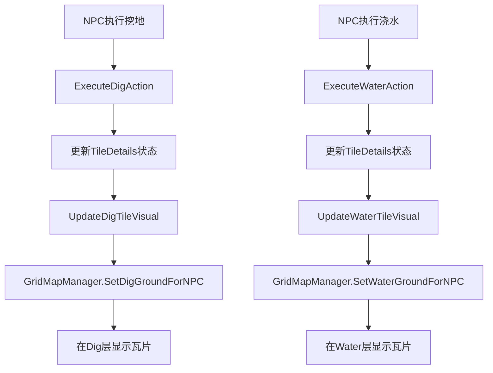

# NPC瓦片更新系统配置指南

## 系统概述

本系统实现了NPC执行耕种和浇水操作后，地块瓦片自动更新的功能。NPC使用锄头挖地后会在Dig层显示挖掘瓦片，使用浇水工具后会在Water层显示浇水瓦片。

## 核心功能

✅ **挖地瓦片更新** - NPC挖地后自动显示挖掘瓦片  
✅ **浇水瓦片更新** - NPC浇水后自动显示浇水瓦片  
✅ **RuleTile支持** - 支持智能瓦片连接和规则化显示  
✅ **坐标精确定位** - 通过坐标精确控制瓦片位置  
✅ **运行时动态切换** - 支持游戏运行时实时瓦片更新  

## Unity编辑器配置步骤

### 步骤1：验证场景Tilemap结构

确认你的场景中有以下Tilemap层级结构：

```
Grid Tilemap (Grid组件)
├── Ground Bottom (地面底层)
├── Ground Middle (地面中层)  
├── Ground Top (地面顶层)
├── Stuff 1 (装饰层1)
├── Stuff 2 (装饰层2)
├── Dig (挖掘层) ← 必须有Tag: "Dig"
├── Water (浇水层) ← 必须有Tag: "Water"
├── Instance (实例层)
├── Front 1 (前景层1)
├── Front 2 (前景层2)
└── Collision (碰撞层)
```

**重要**：确保Dig和Water层有正确的Tag标签！

### 步骤2：配置GridMapManager

1. **找到GridMapManager对象**：
   - 在Hierarchy中找到GridMapManager
   - 确认它有GridMapManager脚本组件

2. **配置瓦片资源**：
   ```csharp
   [Header("地块瓦片切换信息")]
   public RuleTile digTile;    // 拖拽挖掘RuleTile资源
   public RuleTile waterTile;  // 拖拽浇水RuleTile资源
   ```

3. **配置地图数据**：
   ```csharp
   [Header("地图信息")]
   public List<MapData_SO> mapDataList; // 拖拽场景地图数据
   ```

### 步骤3：配置NPCFarmingTask

1. **添加NPCFarmingTask组件**：
   - 选择你的NPC游戏对象
   - 添加NPCFarmingTask脚本组件

2. **配置耕种设置**：
   ```csharp
   [Header("耕种设置")]
   public int preferredSeedID = 1001; // NPC偏好的种子ID
   public float searchRadius = 10f;   // 搜索半径
   public float workingTime = 2f;     // 工作时间
   ```

3. **配置工具设置**：
   ```csharp
   [Header("工具设置")]
   public int hoeToolID = 2001;   // 锄头工具ID
   public int waterToolID = 2002; // 浇水工具ID
   ```

## 代码实现说明

### 核心方法调用流程



### 关键代码片段

#### NPCFarmingTask中的瓦片更新

```csharp
/// <summary>
/// 执行挖地动作 - 完成后更新地块瓦片显示
/// </summary>
private void ExecuteDigAction()
{
    string key = currentTarget.x + "x" + currentTarget.y + "y" + SceneManager.GetActiveScene().name;
    TileDetails tileDetails = GridMapManager.Instance.GetTileDetailes(key);
    
    if (tileDetails != null && tileDetails.canDig)
    {
        // 更新地块状态
        tileDetails.daysSinceDug = 0;
        tileDetails.canDig = false;
        tileDetails.canDropItm = false;
        
        // 保存状态
        GridMapManager.Instance.UpdateTileDetails(tileDetails);
        
        // ✨ 关键：更新视觉瓦片
        UpdateDigTileVisual(tileDetails);
        
        // 播放音效
        EventHandler.CallPlaySoundEvent(SoundName.Hoe);
    }
}
```

#### GridMapManager中的公共接口

```csharp
/// <summary>
/// 为NPC提供的公共接口：更新挖地瓦片显示
/// </summary>
public void SetDigGroundForNPC(TileDetails tileDetails)
{
    if (tileDetails != null)
    {
        SetDigGround(tileDetails); // 调用私有方法
        Debug.Log($"NPC挖地瓦片已更新：位置({tileDetails.gridX}, {tileDetails.gridY})");
    }
}
```

## 测试和调试

### 使用测试脚本

1. **添加测试脚本**：
   - 创建空游戏对象
   - 添加`TileUpdateTest.cs`脚本

2. **配置测试参数**：
   ```csharp
   [Header("测试设置")]
   public Vector2Int testPosition = new Vector2Int(0, 0); // 测试位置
   public bool testDigTile = true;    // 测试挖地瓦片
   public bool testWaterTile = true;  // 测试浇水瓦片
   ```

3. **运行测试**：
   - 运行游戏
   - 按`T`键测试瓦片更新
   - 按`R`键重置测试地块

### 调试信息

系统会输出详细的调试日志：

```
NPC_Girl_02 在位置 (5, 3) 使用锄头挖掘了地块，瓦片已更新
NPC挖地瓦片已更新：位置(5, 3)
NPC_Girl_02 在位置 (5, 3) 执行了浇水操作，瓦片已更新
NPC浇水瓦片已更新：位置(5, 3)
```

### 常见问题排查

#### 问题1：瓦片没有显示
**可能原因**：
- Dig/Water Tilemap对象不存在或未启用
- Tag标签设置错误
- RuleTile资源未正确配置

**解决方案**：
```csharp
// 检查Tilemap是否存在
digTilemap = GameObject.FindWithTag("Dig").GetComponent<Tilemap>();
waterTilemap = GameObject.FindWithTag("Water").GetComponent<Tilemap>();

if (digTilemap == null)
    Debug.LogError("找不到Tag为'Dig'的Tilemap对象！");
if (waterTilemap == null)
    Debug.LogError("找不到Tag为'Water'的Tilemap对象！");
```

#### 问题2：瓦片位置不正确
**可能原因**：
- 坐标计算错误
- Grid组件设置问题

**解决方案**：
```csharp
// 验证坐标转换
Vector3Int pos = new Vector3Int(tileDetails.gridX, tileDetails.gridY, 0);
Debug.Log($"设置瓦片位置：{pos}");
```

#### 问题3：RuleTile连接不正确
**可能原因**：
- RuleTile规则配置错误
- 邻居检测范围问题

**解决方案**：
- 检查RuleTile的连接规则设置
- 确认邻居检测模式正确
- 验证瓦片优先级

## 扩展功能

### 1. 批量瓦片更新

```csharp
/// <summary>
/// 批量更新多个地块的瓦片
/// </summary>
public void BatchUpdateTiles(List<TileDetails> tileDetailsList, bool isDig)
{
    if (tileDetailsList == null || tileDetailsList.Count == 0) return;
    
    foreach (var tileDetails in tileDetailsList)
    {
        if (isDig)
            SetDigGroundForNPC(tileDetails);
        else
            SetWaterGroundForNPC(tileDetails);
    }
}
```

### 2. 季节性瓦片变化

```csharp
/// <summary>
/// 根据季节更新瓦片样式
/// </summary>
public void UpdateSeasonalTiles(Season currentSeason)
{
    // 根据季节选择不同的RuleTile
    RuleTile seasonalDigTile = GetSeasonalDigTile(currentSeason);
    RuleTile seasonalWaterTile = GetSeasonalWaterTile(currentSeason);
    
    // 更新所有现有瓦片...
}
```

### 3. 动画瓦片支持

```csharp
/// <summary>
/// 设置动画瓦片（如流水效果）
/// </summary>
public void SetAnimatedWaterTile(TileDetails tileDetails)
{
    Vector3Int pos = new Vector3Int(tileDetails.gridX, tileDetails.gridY, 0);
    if (waterTilemap != null && animatedWaterTile != null)
    {
        waterTilemap.SetTile(pos, animatedWaterTile);
    }
}
```

## 性能优化建议

1. **瓦片缓存**：缓存常用的瓦片引用
2. **批量更新**：合并多个瓦片更新操作
3. **LOD系统**：远距离使用简化瓦片
4. **延迟更新**：非关键瓦片分帧更新

## 总结

现在你的NPC瓦片视觉更新系统已经完全实现！NPC执行耕种和浇水操作后，地块会立即显示相应的瓦片变化，支持：

- ✅ 智能瓦片连接
- ✅ 规则化显示  
- ✅ 坐标精确控制
- ✅ 运行时动态切换
- ✅ 完整的调试支持

系统已经准备好在你的农场游戏中使用了！ 