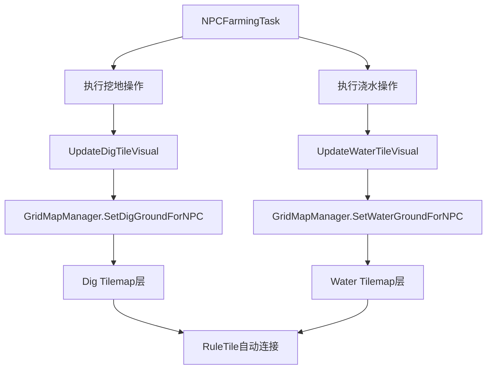

# NPC耕种瓦片视觉更新系统配置指南

## 系统概述

本系统实现了NPC执行耕种和浇水操作后，地块瓦片自动更新的功能。通过Unity的Tilemap系统和RuleTile，实现了智能瓦片连接和规则化显示。

## 核心功能

### 1. **挖地瓦片更新**
- NPC使用锄头工具挖掘地块后，自动在Dig层显示挖掘瓦片
- 支持RuleTile自动连接，相邻的挖掘地块会智能连接成不同形状

### 2. **浇水瓦片更新**
- NPC使用浇水工具浇水后，自动在Water层显示浇水瓦片
- 浇水瓦片会叠加在挖掘瓦片之上，创建复合视觉效果

### 3. **智能瓦片规则**
- 使用Unity的RuleTile系统实现自动瓦片连接
- 根据周围地块状态生成不同形状和方向的瓦片
- 支持角落、边缘、内部等多种瓦片样式

## 系统架构

### 核心组件



### 数据流程

1. **NPC执行操作** → **更新TileDetails** → **调用瓦片更新方法** → **显示视觉效果**

## Unity编辑器配置步骤

### 步骤1：验证Tilemap层结构

确认场景中存在以下Tilemap层（应该已经配置好）：

```
Grid Tilemap
├── Ground Bottom (地面底层)
├── Ground Middle (地面中层)  
├── Ground Top (地面顶层)
├── Stuff 1 (装饰层1)
├── Stuff 2 (装饰层2)
├── Dig (挖掘层) ← Tag: "Dig"
├── Water (浇水层) ← Tag: "Water"
├── Instance (实例层)
├── Front 1 (前景层1)
├── Front 2 (前景层2)
└── Collision (碰撞层)
```

### 步骤2：配置GridMapManager

1. **检查GridMapManager组件**：
   - 在场景中找到GridMapManager对象
   - 确认以下字段已正确配置：

```csharp
[Header("地块瓦片切换信息")]
public RuleTile digTile;    // 挖掘瓦片（RuleTile）
public RuleTile waterTile;  // 浇水瓦片（RuleTile）

[Header("地图信息")]
public List<MapData_SO> mapDataList; // 场景地图数据列表
```

2. **拖拽RuleTile资源**：
   - `digTile` ← 拖拽挖掘RuleTile资源
   - `waterTile` ← 拖拽浇水RuleTile资源

### 步骤3：验证RuleTile配置

确认RuleTile资源包含以下瓦片规则：

#### 挖掘RuleTile (digTile)
- 单独瓦片（孤立地块）
- 水平连接瓦片（左、中、右）
- 垂直连接瓦片（上、中、下）
- 角落瓦片（左上、右上、左下、右下）
- 内部连接瓦片

#### 浇水RuleTile (waterTile)
- 与挖掘瓦片类似的连接规则
- 支持叠加显示在挖掘瓦片之上

## 代码实现详解

### NPCFarmingTask中的瓦片更新

```csharp
/// <summary>
/// 执行挖地动作 - 完成后更新地块瓦片显示
/// </summary>
private void ExecuteDigAction()
{
    // 1. 获取地块信息
    string key = currentTarget.x + "x" + currentTarget.y + "y" + SceneManager.GetActiveScene().name;
    TileDetails tileDetails = GridMapManager.Instance.GetTileDetailes(key);
    
    if (tileDetails != null && tileDetails.canDig)
    {
        // 2. 更新地块状态
        tileDetails.daysSinceDug = 0;
        tileDetails.canDig = false;
        tileDetails.canDropItm = false;
        
        // 3. 保存状态到管理器
        GridMapManager.Instance.UpdateTileDetails(tileDetails);
        
        // 4. ✨ 关键：更新视觉瓦片
        UpdateDigTileVisual(tileDetails);
        
        // 5. 播放音效
        EventHandler.CallPlaySoundEvent(SoundName.Hoe);
    }
}

/// <summary>
/// 更新挖地瓦片的视觉显示
/// </summary>
private void UpdateDigTileVisual(TileDetails tileDetails)
{
    var gridMapManager = GridMapManager.Instance;
    if (gridMapManager != null)
    {
        // 调用GridMapManager的公共接口
        gridMapManager.SetDigGroundForNPC(tileDetails);
    }
}
```

### GridMapManager中的瓦片设置

```csharp
/// <summary>
/// 为NPC提供的公共接口：更新挖地瓦片显示
/// </summary>
public void SetDigGroundForNPC(TileDetails tileDetails)
{
    if (tileDetails != null)
    {
        SetDigGround(tileDetails); // 调用私有方法
        Debug.Log($"NPC挖地瓦片已更新：位置({tileDetails.gridX}, {tileDetails.gridY})");
    }
}

/// <summary>
/// 显示挖坑瓦片（私有方法）
/// </summary>
private void SetDigGround(TileDetails tile)
{
    Vector3Int pos = new Vector3Int(tile.gridX, tile.gridY, 0);
    if (digTilemap != null)
    {
        digTilemap.SetTile(pos, digTile); // 设置瓦片到Dig层
    }
}
```

## 瓦片连接规则系统

### RuleTile自动连接原理

1. **邻居检测**：RuleTile会自动检测周围8个方向的邻居瓦片
2. **规则匹配**：根据预设的连接规则选择合适的瓦片样式
3. **动态更新**：当新瓦片添加时，系统会自动更新周围瓦片的连接状态

### 连接形状示例

```
孤立瓦片：   水平连接：     垂直连接：     角落连接：
   ●          ●●●           ●             ●●
               ●            ●             ●●
                           ●           
```

## 测试和调试

### 调试信息

系统会输出详细的调试日志：

```
NPC_Girl_02 在位置 (5, 3) 使用锄头挖掘了地块，瓦片已更新
NPC挖地瓦片已更新：位置(5, 3)
NPC_Girl_02 在位置 (5, 3) 执行了浇水操作，瓦片已更新
NPC浇水瓦片已更新：位置(5, 3)
```

### 测试清单

- [ ] NPC挖地后Dig层显示挖掘瓦片
- [ ] NPC浇水后Water层显示浇水瓦片
- [ ] 相邻瓦片能正确连接形成连续图案
- [ ] 瓦片规则按预期工作（角落、边缘、内部）
- [ ] 没有控制台错误或警告
- [ ] 瓦片更新与NPC动画同步
- [ ] 地块状态正确保存和加载

### 常见问题排查

#### 问题1：瓦片没有显示
- 检查Dig/Water Tilemap对象是否存在且启用
- 确认GridMapManager中的digTile/waterTile已正确配置
- 验证瓦片坐标计算是否正确

#### 问题2：瓦片连接规则不正确
- 检查RuleTile的连接规则配置
- 确认邻居检测范围设置正确
- 验证瓦片优先级和排序规则

#### 问题3：性能问题
- 考虑批量更新瓦片而不是逐个更新
- 使用SetTilesBlock方法进行批量操作
- 限制同时更新的瓦片数量

## 扩展功能

### 1. 批量瓦片更新

```csharp
/// <summary>
/// 批量更新多个地块的瓦片
/// </summary>
public void BatchUpdateTiles(List<TileDetails> tileDetailsList, bool isDig)
{
    if (tileDetailsList == null || tileDetailsList.Count == 0) return;
    
    var positions = new Vector3Int[tileDetailsList.Count];
    var tiles = new TileBase[tileDetailsList.Count];
    var targetTile = isDig ? digTile : waterTile;
    
    for (int i = 0; i < tileDetailsList.Count; i++)
    {
        positions[i] = new Vector3Int(tileDetailsList[i].gridX, tileDetailsList[i].gridY, 0);
        tiles[i] = targetTile;
    }
    
    var targetTilemap = isDig ? digTilemap : waterTilemap;
    targetTilemap.SetTilesBlock(new BoundsInt(positions[0], Vector3Int.one), tiles);
}
```

### 2. 动画瓦片支持

```csharp
/// <summary>
/// 设置动画瓦片（如流水效果）
/// </summary>
public void SetAnimatedWaterTile(TileDetails tileDetails)
{
    Vector3Int pos = new Vector3Int(tileDetails.gridX, tileDetails.gridY, 0);
    if (waterTilemap != null && animatedWaterTile != null)
    {
        waterTilemap.SetTile(pos, animatedWaterTile);
    }
}
```

### 3. 季节性瓦片变化

```csharp
/// <summary>
/// 根据季节更新瓦片样式
/// </summary>
public void UpdateSeasonalTiles(Season currentSeason)
{
    var seasonalDigTile = GetSeasonalTile(digTile, currentSeason);
    var seasonalWaterTile = GetSeasonalTile(waterTile, currentSeason);
    
    // 重新设置所有瓦片...
}
```

## 性能优化建议

1. **瓦片缓存**：缓存常用的瓦片引用避免重复查找
2. **批量更新**：在单帧内合并多个瓦片更新操作
3. **LOD系统**：远距离地块使用简化瓦片规则
4. **延迟更新**：非关键瓦片更新可以分帧执行

现在NPC瓦片视觉更新系统已经完全实现！NPC执行耕种和浇水操作后，地块会立即显示相应的瓦片变化，支持智能连接和规则化显示。 