# PPT所需图表 - Mermaid语法

## 第3页：系统总体架构图

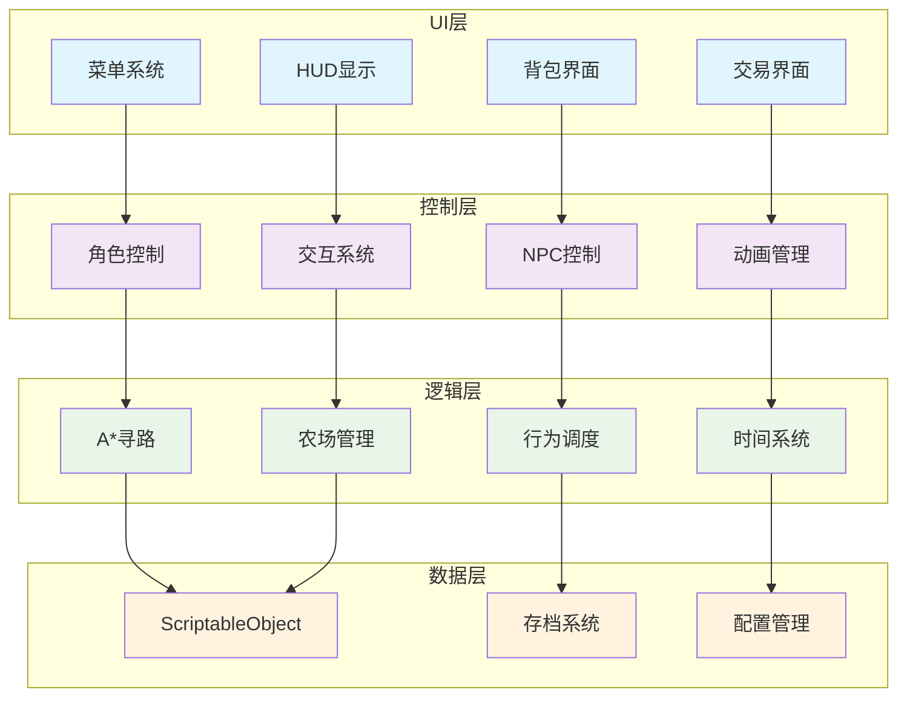

## 第4页：A*寻路算法流程图

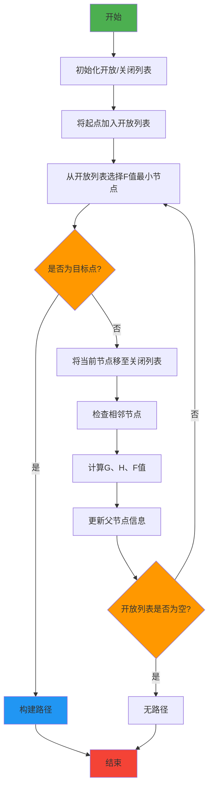

## 第5页：核心玩法循环图


## 第7页：系统集成架构图

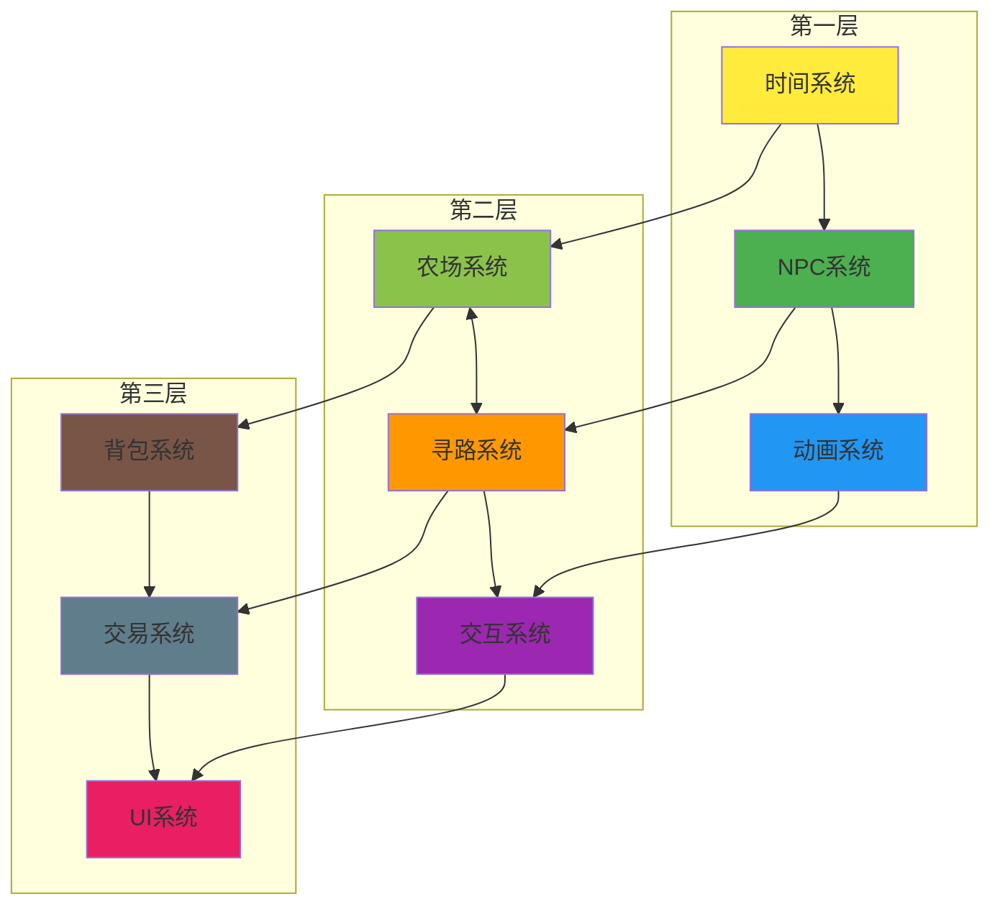

## 第9页：技术路线图

```mermaid
gantt
    title 技术路线图
    dateFormat  X
    axisFormat %s
    
    section 需求分析
    市场调研     :done, des1, 0, 1
    用户分析     :done, des2, 0, 1
    
    section 系统设计
    架构设计     :done, des3, 1, 2
    模块划分     :done, des4, 1, 2
    
    section 原型开发
    MVP验证      :done, des5, 2, 3
    可行性       :done, des6, 2, 3
    
    section 核心实现
    功能开发     :active, des7, 3, 5
    系统集成     :des8, 4, 6
    
    section 测试优化
    性能调优     :des9, 5, 6
    Bug修复      :des10, 5, 6
    
    section 部署发布
    版本发布     :des11, 6, 7
    文档完善     :des12, 6, 7
```

## 第10页：开发时间轴

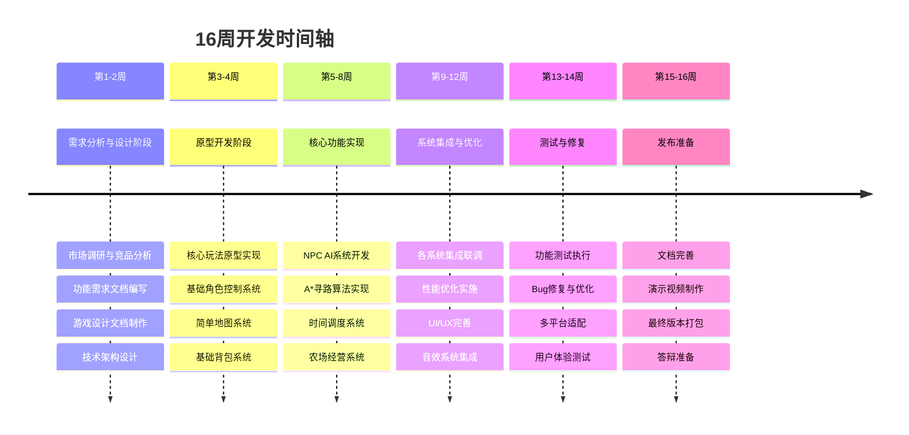

## 第11页：Git工作流程图

```mermaid
gitgraph
    commit id: "Initial"
    branch develop
    checkout develop
    commit id: "Setup"
    branch feature/npc-ai
    checkout feature/npc-ai
    commit id: "A* Algorithm"
    commit id: "Behavior Tree"
    checkout develop
    merge feature/npc-ai
    branch feature/farming
    checkout feature/farming
    commit id: "Crop System"
    commit id: "Inventory"
    checkout develop
    merge feature/farming
    checkout main
    merge develop
    commit id: "Release v1.0"
```

## 第11页：测试金字塔图

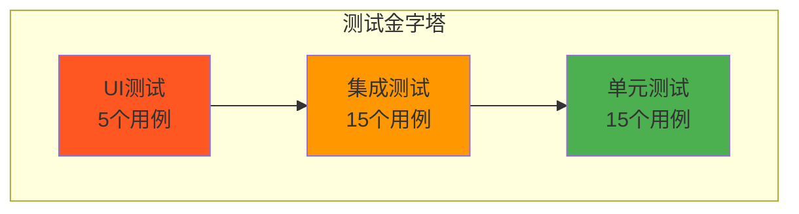

## 第13页：性能优化对比图

```mermaid
xychart-beta
    title "性能优化对比"
    x-axis [内存使用, CPU使用率, 帧率稳定性, 加载时间]
    y-axis "性能指标" 0 --> 100
    bar [100, 40, 45, 100]
    bar [35, 25, 60, 42]
```

## 第14页：测试覆盖范围饼图

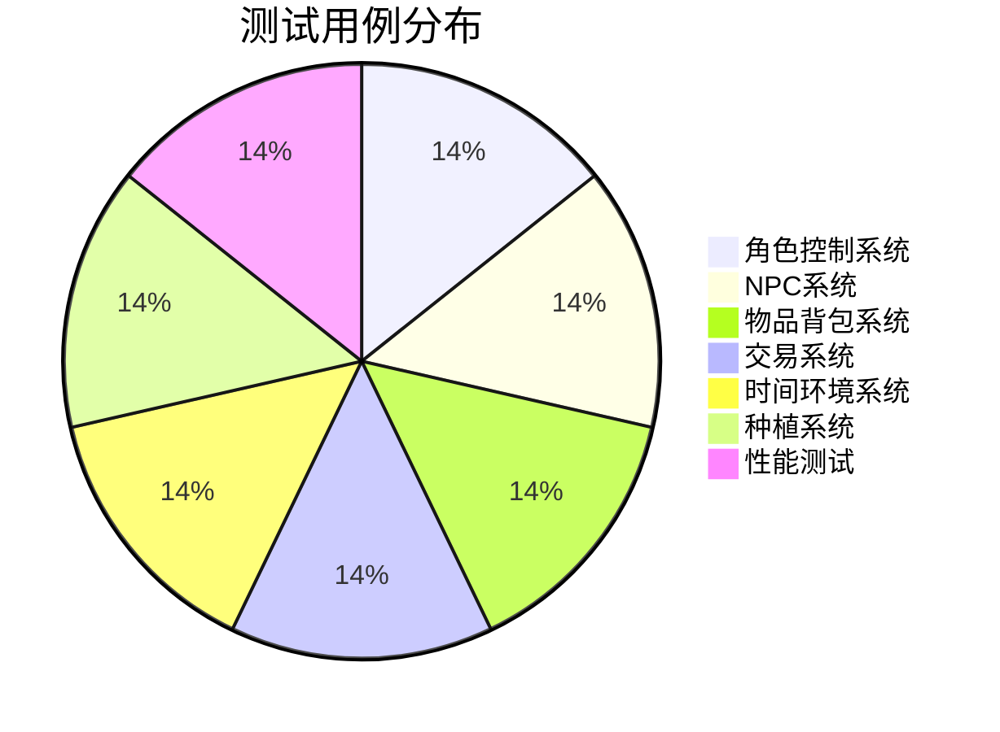

## 第15页：市场规模分析图

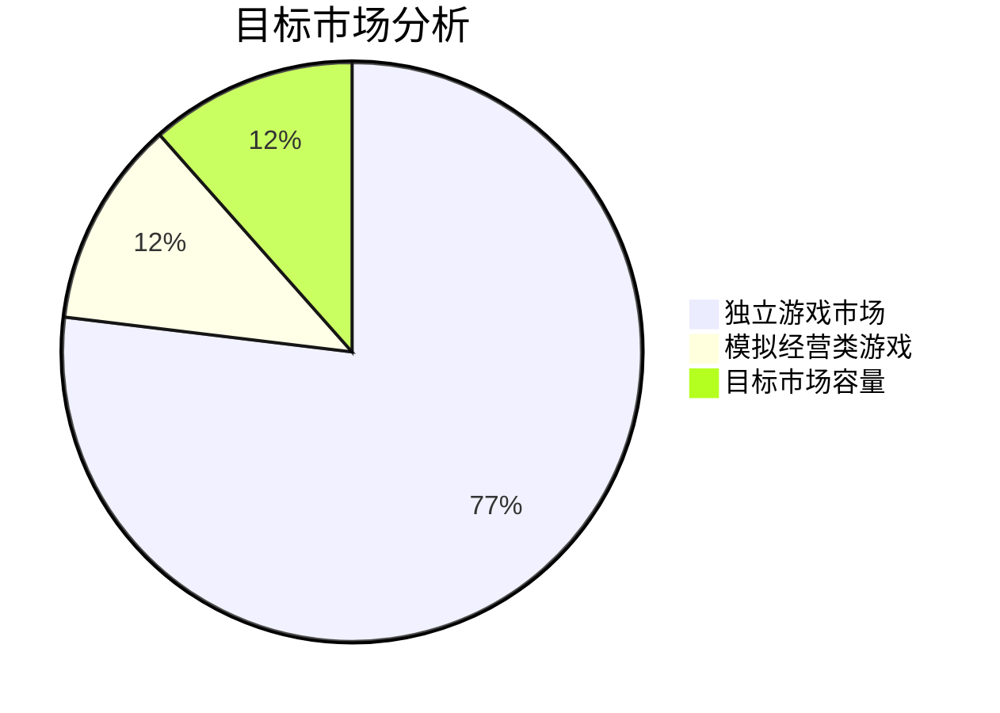

## 第15页：技术产品化路线图

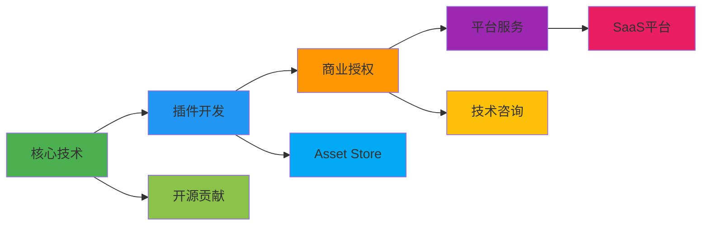

## 第16页：项目目标达成情况图

```mermaid
xychart-beta
    title "项目目标达成情况"
    x-axis [完整游戏系统, NPC智能行为, 性能优化, 技术创新, 文档完善]
    y-axis "达成度(%)" 0 --> 100
    bar [100, 100, 100, 100, 100]
```

## 第16页：未来发展规划图

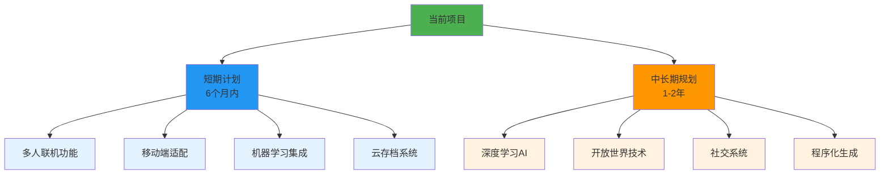

## 第6页：NPC行为状态机图

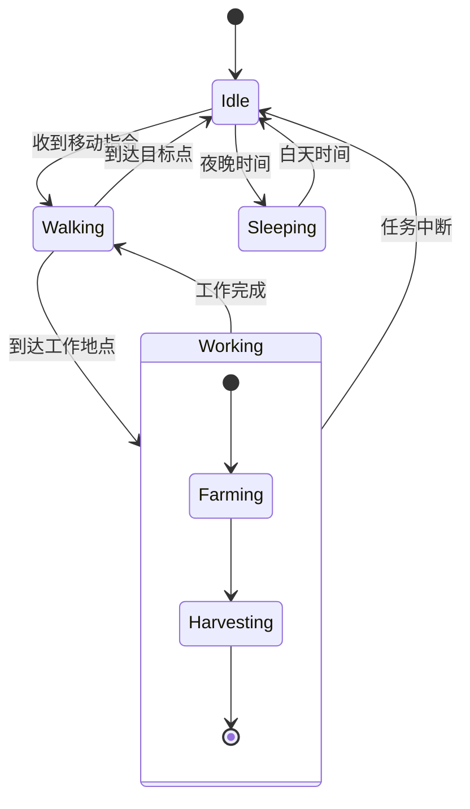

## 第8页：NPC系统架构图

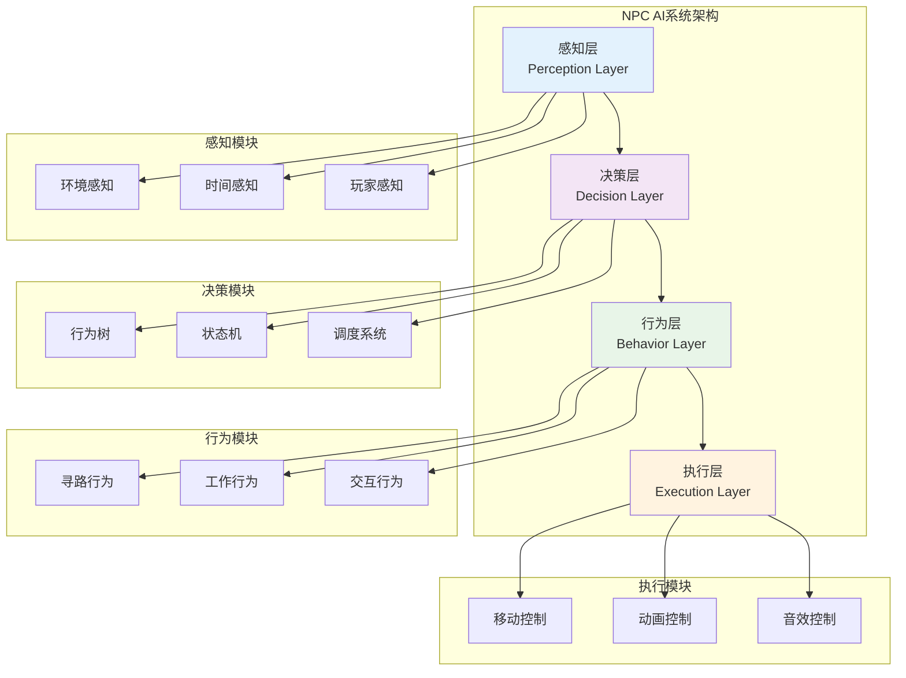

## 第12页：项目规模统计图

```mermaid
xychart-beta
    title "项目规模统计"
    x-axis [代码行数, 功能模块, 资源文件, 测试用例, 开发周期]
    y-axis "数量" 0 --> 16000
    bar [15000, 12, 500, 35, 16]
```

## 第13页：A*寻路性能对比图

```mermaid
xychart-beta
    title "A*寻路系统性能达成情况"
    x-axis [简单路径计算, 复杂路径计算, 多NPC同时寻路, 动态避障响应]
    y-axis "性能倍数" 0 --> 900
    line [240, 833, 156, 476]
```

## 第14页：帧率稳定性分布图

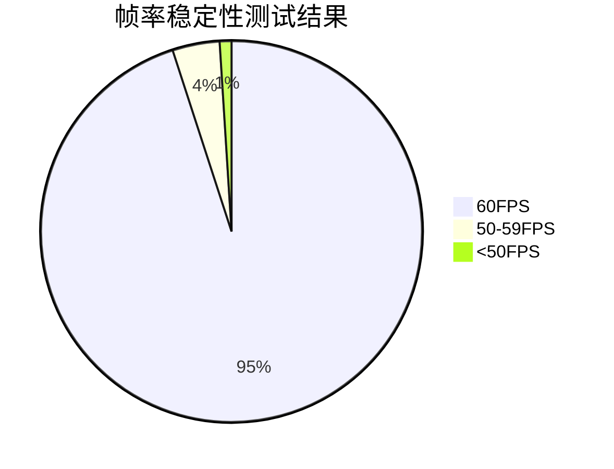

## 第14页：内存使用趋势图

```mermaid
xychart-beta
    title "内存使用趋势"
    x-axis [初始, 1小时, 2小时, 3小时, 4小时]
    y-axis "内存使用(MB)" 150 --> 250
    line [180, 200, 210, 230, 245]
```

## 螺旋搜索算法示意图

```mermaid
graph TB
    subgraph "螺旋搜索模式"
        A[起始点<br/>0,0] --> B[右<br/>1,0]
        B --> C[上<br/>1,1]
        C --> D[左<br/>0,1]
        D --> E[左<br/>-1,1]
        E --> F[下<br/>-1,0]
        F --> G[下<br/>-1,-1]
        G --> H[右<br/>0,-1]
        H --> I[右<br/>1,-1]
        I --> J[右<br/>2,-1]
        J --> K[继续螺旋...]
    end
    
    style A fill:#4caf50
    style B fill:#2196f3
    style C fill:#2196f3
    style D fill:#ff9800
    style E fill:#ff9800
    style F fill:#f44336
    style G fill:#f44336
    style H fill:#9c27b0
    style I fill:#9c27b0
    style J fill:#9c27b0
```

## 对象池系统工作原理图

```mermaid
graph LR
    subgraph "对象池系统"
        A[对象池<br/>Object Pool] 
        B[活跃对象<br/>Active Objects]
        C[非活跃对象<br/>Inactive Objects]
    end
    
    D[请求对象] --> A
    A --> E{池中有对象?}
    E -->|是| F[从池中取出]
    E -->|否| G[创建新对象]
    F --> B
    G --> B
    B --> H[使用完毕]
    H --> I[返回池中]
    I --> C
    C --> A
    
    style A fill:#4caf50
    style B fill:#2196f3
    style C fill:#ff9800
    style D fill:#e3f2fd
    style H fill:#f3e5f5
``` 