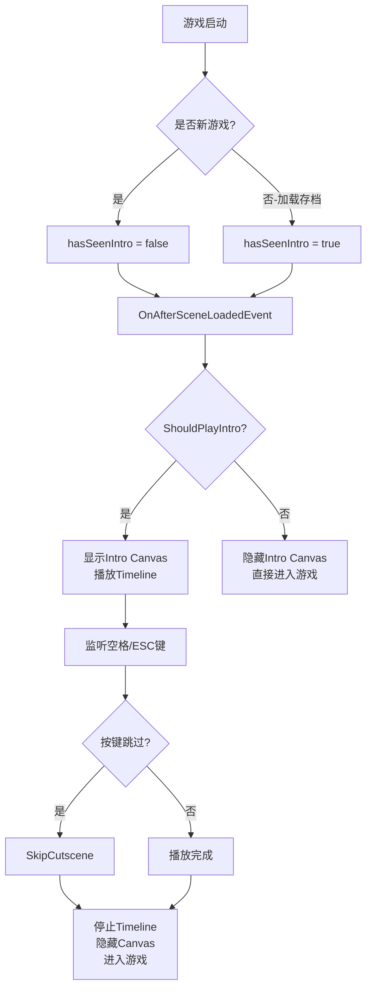

# 开场动画制作逻辑解析与修复方案

## 📽️ 项目开场动画制作逻辑

### 1. **动画架构**

这个项目的开场动画是基于 **Unity Timeline + UI Canvas** 的混合方案：

```
PersistentScene
├── TimelineManager (GameObject)
│   ├── TimelineManager.cs (脚本)
│   └── PlayableDirector (组件)
│       └── NewGame CutsceneTimeline.playable (Timeline资源)
│
└── Intro Canvas (UI Canvas)
    └── Panel
        ├── Shot (UI Image)
        ├── Shot (1) (UI Image)
        ├── Shot (2) (UI Image)
        ├── Shot (3) (UI Image)
        ├── Shot (4) (UI Image)
        ├── Shot (5) (UI Image)
        └── Shot (7) (UI Image)
```

### 2. **动画控制机制**

#### **Timeline控制UI元素**
- **PlayableDirector** 播放 `NewGame CutsceneTimeline.playable`
- **Timeline** 控制 Intro Canvas 下各个 Shot 的：
  - `m_Color.a` (透明度)：实现淡入淡出效果
  - `m_AnchoredPosition` (位置)：实现移动效果
  - `m_IsActive` (激活状态)：控制显示/隐藏

#### **动画时间轴**
从Timeline文件分析，动画总时长约 **21.5秒**：
- 0-2.45秒：Shot 淡入
- 3.4-5.0秒：Shot(1) 淡入
- 5.0-9.2秒：Shot(2) 淡入
- 9.2-10.9秒：Shot(3) 淡入
- 10.9-13.5秒：Shot(4) 淡入
- 继续直到21.5秒结束

### 3. **脚本控制流程**



## 🐛 原问题分析

### **问题1：按空格无法跳过**
**原因**：
- Timeline正在播放但跳过逻辑不正确
- Intro Canvas没有被正确隐藏
- 输入检测可能被其他UI阻挡

### **问题2：旧存档仍播放动画**
**原因**：
- `isLoadingExistingSave` 标志未正确设置
- `hasSeenIntro` 状态保存/恢复机制有问题
- Intro Canvas在加载时默认激活

## ✅ 修复方案

### 1. **增强Canvas控制**

```csharp
[Header("UI引用")]
public Canvas introCanvas; // 直接引用Intro Canvas

/// <summary>
/// 显示或隐藏Intro Canvas
/// </summary>
private void ShowIntroCanvas(bool show)
{
    if (introCanvas != null)
    {
        introCanvas.gameObject.SetActive(show);
        Debug.Log($"Intro Canvas {(show ? "显示" : "隐藏")}");
    }
}
```

### 2. **改进跳过逻辑**

```csharp
public void SkipCutscene()
{
    if (currentDirector != null && currentDirector.state == PlayState.Playing)
    {
        Debug.Log("执行跳过开场动画");
        
        // 停止Timeline播放
        currentDirector.Stop();
        
        // 隐藏Intro Canvas
        ShowIntroCanvas(false);
        
        // 标记已观看并进入游戏
        if (currentDirector == startDirector)
        {
            hasSeenIntro = true;
            EventHandler.CallUpdateGameStateEvent(GameState.Gameplay);
        }
    }
}
```

### 3. **完善状态判断**

```csharp
private bool ShouldPlayIntro()
{
    // 优先检查是否正在加载存档
    if (SaveLoadManager.Instance != null && SaveLoadManager.Instance.isLoadingExistingSave)
    {
        return false;
    }
    
    // 检查是否已经看过
    if (hasSeenIntro)
    {
        return false;
    }
    
    // 其他条件检查
    return currentDirector == startDirector && !hasSeenIntro;
}
```

## 🎮 Unity编辑器设置

### 1. **TimelineManager设置**
1. 在Unity编辑器中选择 TimelineManager 对象
2. 在Inspector中找到 TimelineManager 组件
3. 将 Intro Canvas 拖拽到 "Intro Canvas" 字段
4. 确保 Start Director 指向正确的 PlayableDirector

### 2. **Intro Canvas设置**
1. 确保 Intro Canvas 的 Sort Order 足够高（如10）
2. 确保所有 Shot 对象都正确配置了 Image 组件
3. 检查 Timeline 绑定是否正确

## 🔧 调试步骤

### 1. **新游戏测试**
```
1. 启动游戏，点击空存档槽
2. 检查控制台是否显示："播放开场动画"
3. 测试空格键和ESC键跳过功能
4. 确认跳过后显示："TimelineManager: 标记玩家已经看过开场动画"
```

### 2. **旧存档测试**
```
1. 保存游戏进度（按I键）
2. 重启游戏，点击有数据的存档槽
3. 检查控制台是否显示："检测到正在加载存档，跳过开场动画"
4. 确认直接进入游戏，无开场动画
```

### 3. **控制台日志监控**
```
预期日志序列：
- 新游戏：播放开场动画 → 检测到跳过按键 → 执行跳过开场动画 → Intro Canvas 隐藏
- 旧存档：检测到正在加载存档 → 跳过开场动画，直接进入游戏 → Intro Canvas 隐藏
```

## 🎯 关键修复点

1. **自动Canvas引用**：代码会自动查找"Intro Canvas"对象
2. **强制Canvas控制**：确保Canvas在合适时机显示/隐藏
3. **增强跳过逻辑**：直接停止Timeline并隐藏Canvas
4. **完善状态检查**：多重条件确保旧存档跳过动画
5. **详细日志输出**：便于调试和验证

## 📝 保存存档的方法

### 手动保存：
- **按 I 键**：手动保存当前游戏进度
- **按 O 键**：加载保存的游戏进度

### 自动保存：
- 游戏结束时自动触发保存

### 存档位置：
```
Windows: %AppData%/LocalLow/[公司名]/[游戏名]/SAVE DATA/
文件格式: data0.json, data1.json, data2.json
```

现在您的开场动画系统应该能正确工作：新游戏播放动画（可跳过），旧存档直接进入游戏！ 