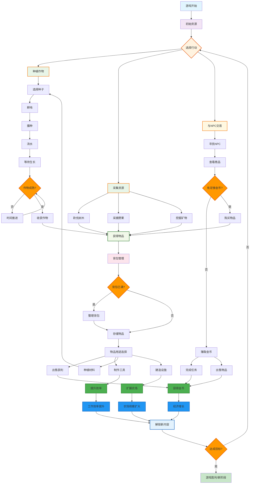
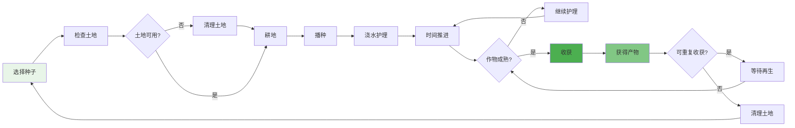
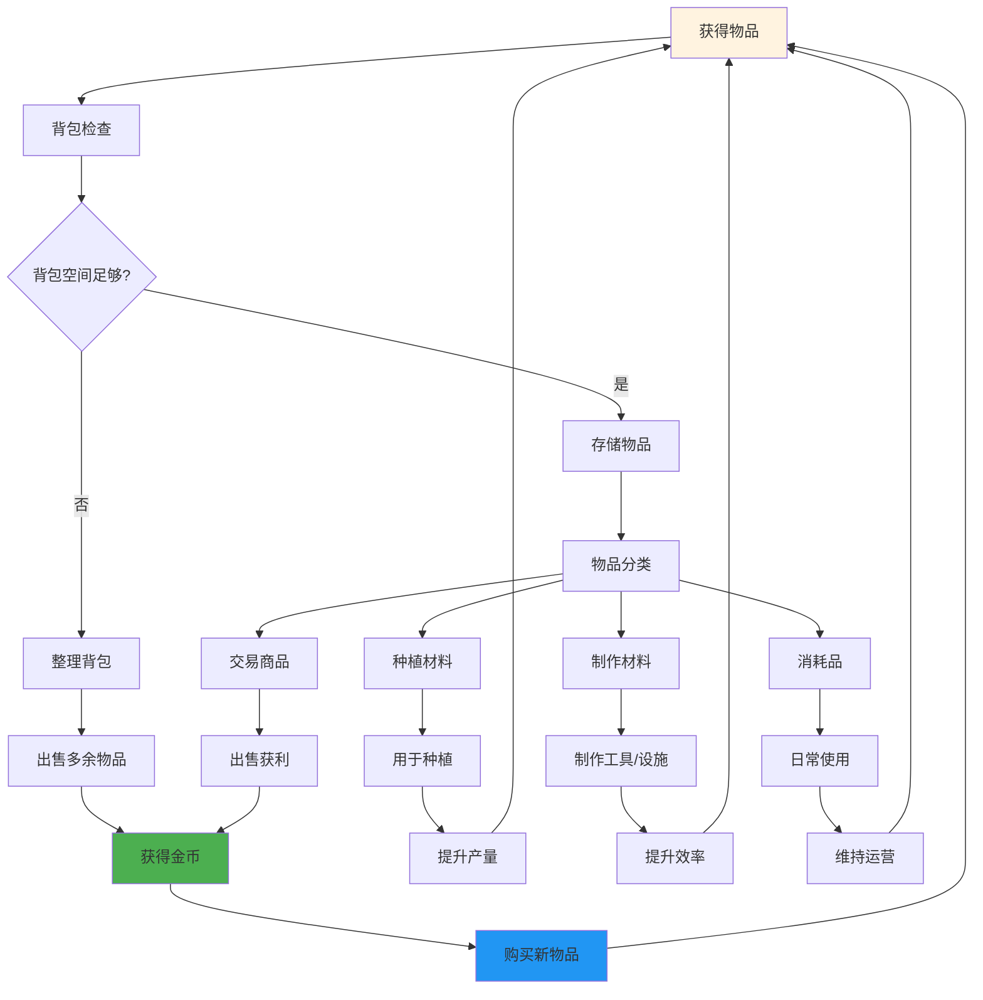
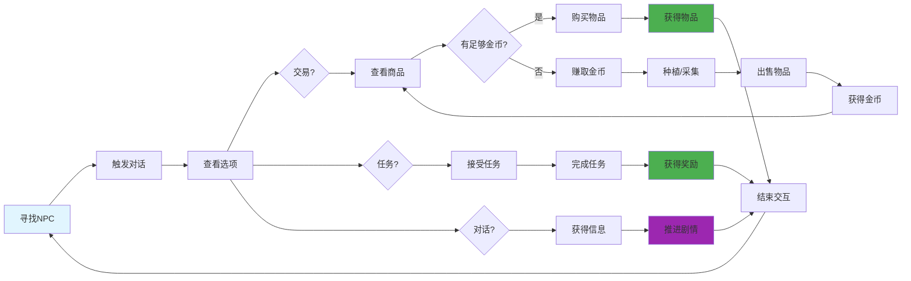
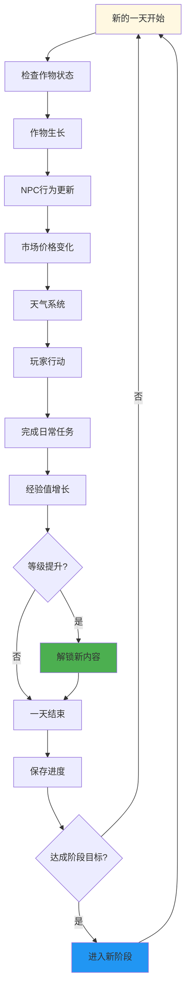

# 农场模拟经营游戏 - 核心玩法循环图

## 主要玩法循环图

## 详细子系统循环图

### 1. 种植系统循环

### 2. 资源管理循环

### 3. NPC交互循环

### 4. 时间与进度系统

## 核心玩法要素说明

### 🌱 **种植系统**
- **耕地** → **播种** → **护理** → **收获** → **再种植**
- 不同作物有不同的生长周期和收益
- 季节和天气影响作物生长

### 💰 **经济系统**
- **收获物品** → **出售获利** → **购买升级** → **提升效率**
- 市场价格波动影响收益策略
- 投资回报循环驱动游戏进程

### 🤝 **社交系统**
- **与NPC交互** → **建立关系** → **解锁内容** → **获得帮助**
- 任务系统提供目标导向
- 对话系统推进故事情节

### ⚡ **进度系统**
- **完成活动** → **获得经验** → **等级提升** → **解锁功能**
- 技能树系统提供成长路径
- 成就系统增加游戏深度

这个核心玩法循环图展示了农场游戏的完整生态系统，每个环节都相互关联，形成了一个自我强化的游戏循环，让玩家在种植、收获、交易、升级的过程中获得持续的成就感和进步感。 