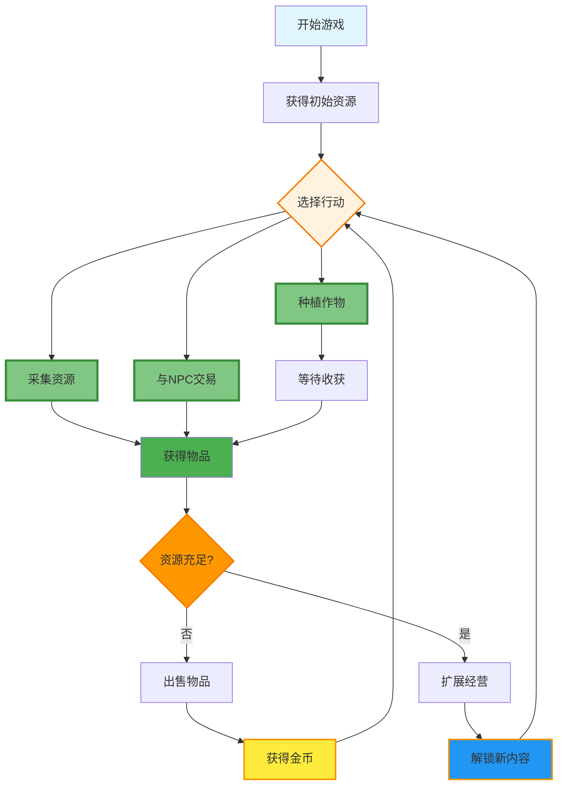
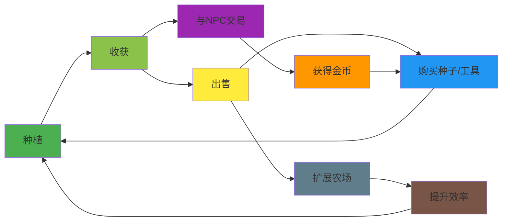
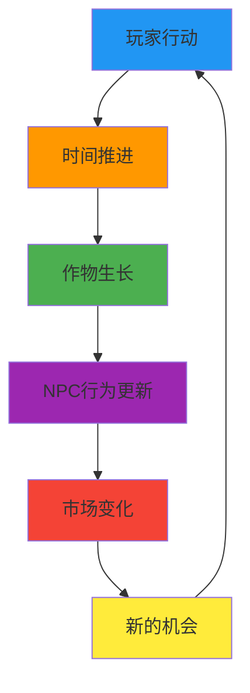
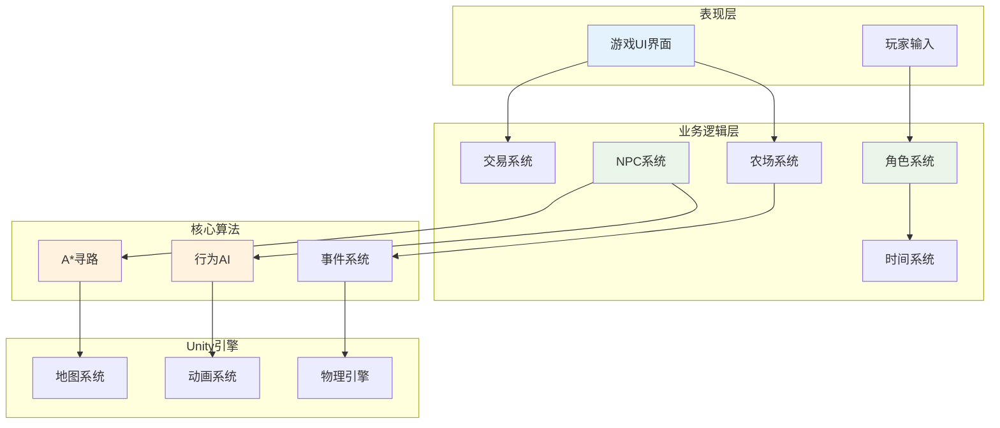
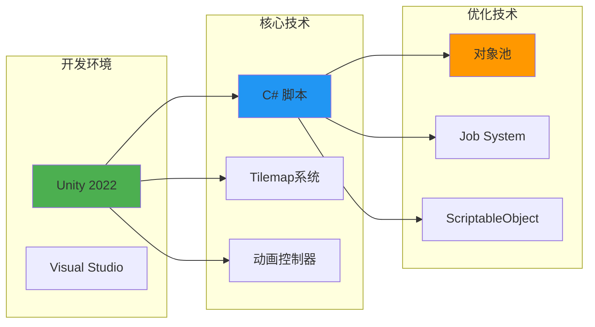
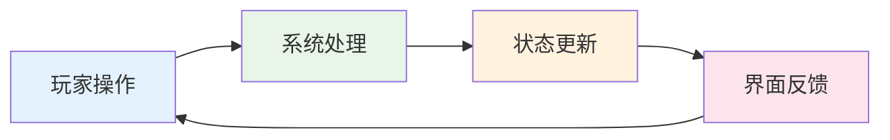
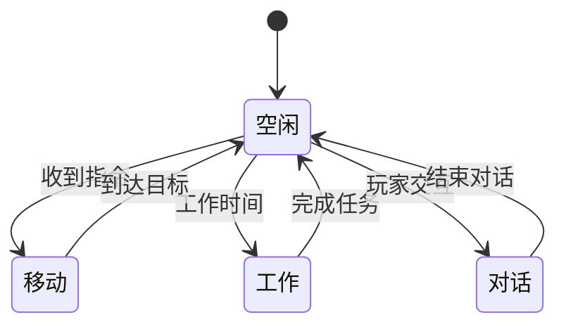
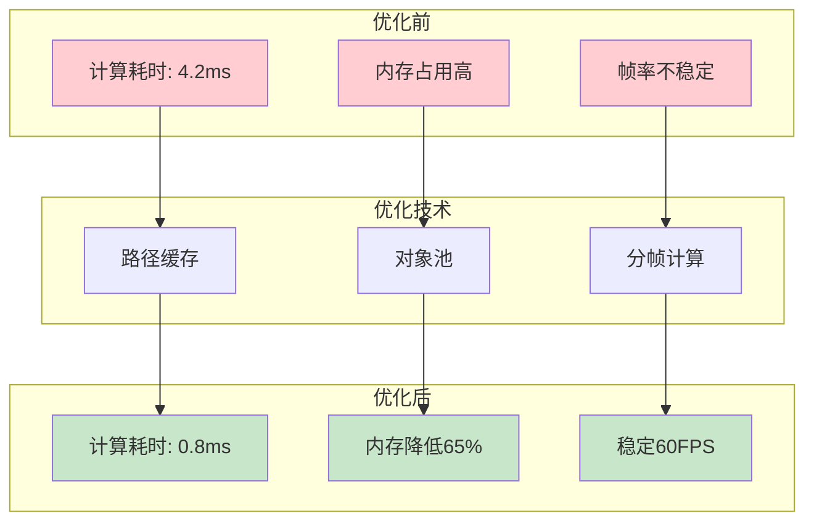

# 农场模拟经营游戏 - 精简核心玩法循环图

## 核心玩法循环（最简版）

## 详细核心循环（中等复杂度）

## 系统交互核心循环

## 核心玩法要素（最简化）

### 🌱 **种植循环**
**播种** → **等待** → **收获** → **出售** → **再投资**

### 💰 **经济循环**  
**获得物品** → **出售获利** → **购买升级** → **提升效率**

### 🤝 **社交循环**
**与NPC交互** → **完成交易** → **解锁内容** → **获得优势**

### ⏰ **时间循环**
**日夜更替** → **作物成熟** → **NPC活动** → **新的一天**

## 核心设计理念

1. **简单易懂**：玩家可以快速理解基本循环
2. **自我强化**：每个行动都能带来进步
3. **多路径选择**：种植、采集、交易三条主线
4. **持续激励**：短期收获与长期目标结合

这个精简版本突出了游戏的核心循环，去除了复杂的分支，让玩家能够清晰地看到游戏的基本玩法逻辑。

# 精简版系统架构图

## 1. 精简系统架构图

## 2. 核心技术栈图

## 3. 简化的玩法循环

## 4. NPC核心状态

## 5. 性能优化要点

