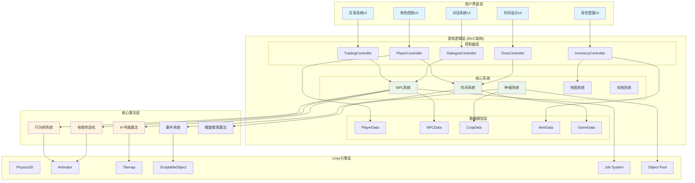
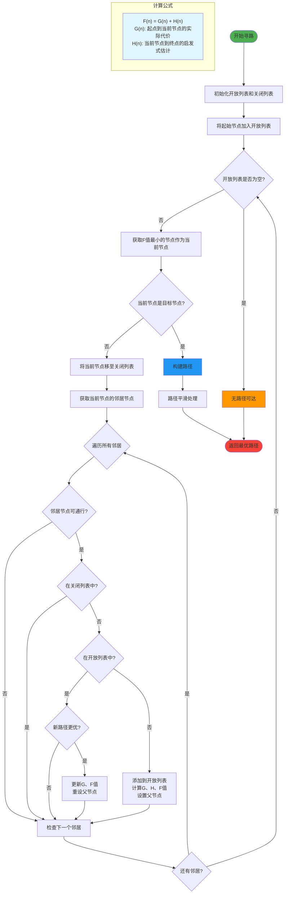
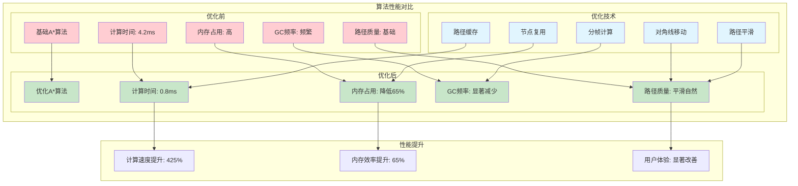
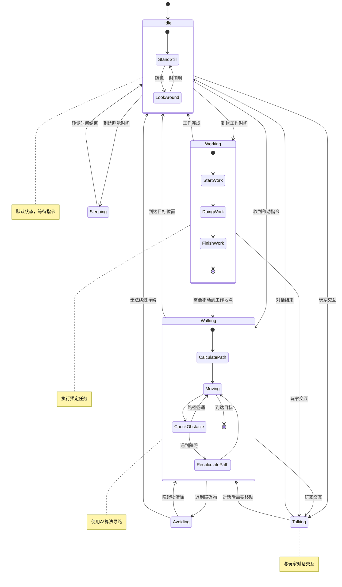
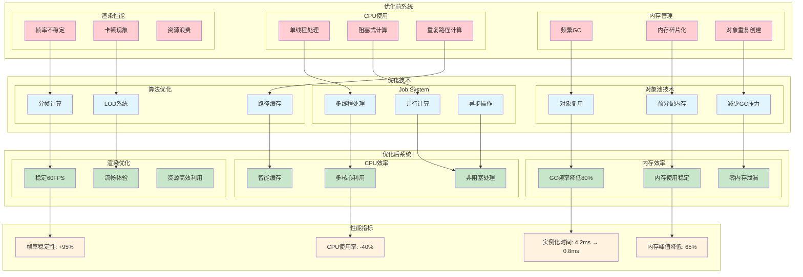
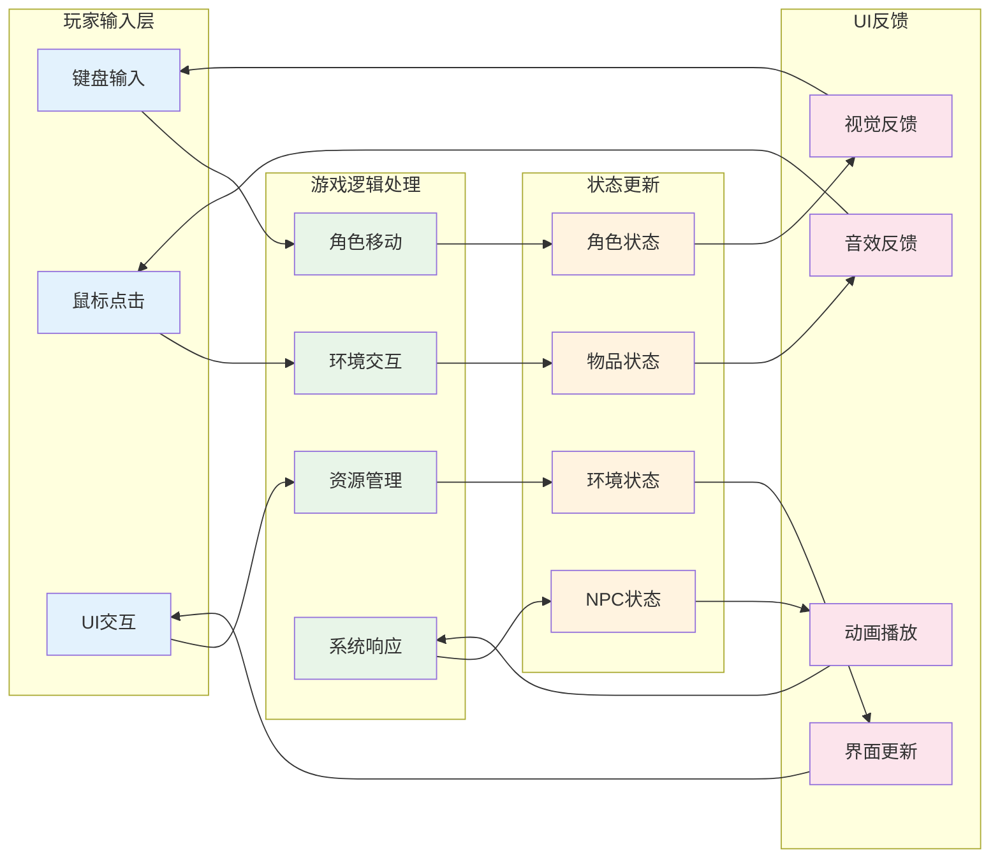
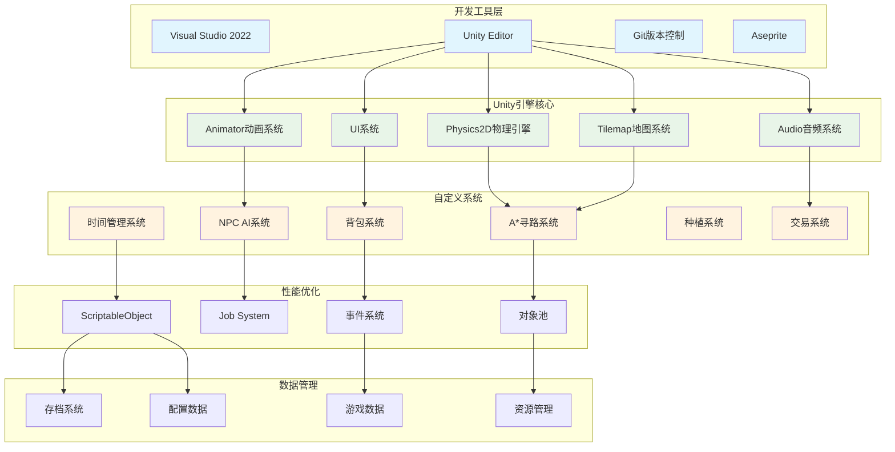

# 基于Unity的模拟经营游戏 - 项目图表集合

## 1. 系统整体架构图

```mermaid
graph TB
    subgraph "用户界面层"
        UI1[角色控制UI]
        UI2[背包管理UI]
        UI3[交易系统UI]
        UI4[对话系统UI]
        UI5[时间显示UI]
    end
    
    subgraph "游戏逻辑层 (MVC架构)"
        subgraph "控制器层"
            C1[PlayerController]
            C2[InventoryController]
            C3[TradingController]
            C4[DialogueController]
            C5[TimeController]
        end
        
        subgraph "核心系统"
            S1[时间系统]
            S2[NPC系统]
            S3[种植系统]
            S4[地图系统]
            S5[存档系统]
        end
        
        subgraph "数据模型层"
            M1[PlayerData]
            M2[NPCData]
            M3[CropData]
            M4[ItemData]
            M5[GameData]
        end
    end
    
    subgraph "核心算法层"
        A1[A*寻路算法]
        A2[行为树系统]
        A3[有限状态机]
        A4[事件系统]
        A5[螺旋搜索算法]
    end
    
    subgraph "Unity引擎层"
        U1[Physics2D]
        U2[Animator]
        U3[Tilemap]
        U4[ScriptableObject]
        U5[Job System]
        U6[Object Pool]
    end
    
    UI1 --> C1
    UI2 --> C2
    UI3 --> C3
    UI4 --> C4
    UI5 --> C5
    
    C1 --> S1
    C2 --> S4
    C3 --> S2
    C4 --> S2
    C5 --> S1
    
    S1 --> A4
    S2 --> A1
    S2 --> A2
    S2 --> A3
    S3 --> A5
    
    S1 --> M5
    S2 --> M2
    S3 --> M3
    C2 --> M4
    C1 --> M1
    
    A1 --> U3
    A2 --> U2
    A3 --> U2
    A4 --> U4
    S2 --> U5
    S3 --> U6
    
    style UI1 fill:#e1f5fe
    style UI2 fill:#e1f5fe
    style UI3 fill:#e1f5fe
    style UI4 fill:#e1f5fe
    style UI5 fill:#e1f5fe
    style S1 fill:#e8f5e8
    style S2 fill:#e8f5e8
    style S3 fill:#e8f5e8
    style A1 fill:#fff3e0
    style A2 fill:#fff3e0
    style A3 fill:#fff3e0
```

## 2. A*算法流程图

```mermaid
flowchart TD
    Start([开始寻路]) --> Init[初始化开放列表和关闭列表]
    Init --> AddStart[将起始节点加入开放列表]
    AddStart --> CheckOpen{开放列表是否为空?}
    
    CheckOpen -->|是| NoPath[无路径可达]
    CheckOpen -->|否| GetCurrent[获取F值最小的节点作为当前节点]
    
    GetCurrent --> IsTarget{当前节点是目标节点?}
    IsTarget -->|是| BuildPath[构建路径]
    IsTarget -->|否| MoveToClosed[将当前节点移至关闭列表]
    
    MoveToClosed --> GetNeighbors[获取当前节点的邻居节点]
    GetNeighbors --> CheckNeighbor{遍历所有邻居}
    
    CheckNeighbor --> IsWalkable{邻居节点可通行?}
    IsWalkable -->|否| NextNeighbor[检查下一个邻居]
    IsWalkable -->|是| InClosed{在关闭列表中?}
    
    InClosed -->|是| NextNeighbor
    InClosed -->|否| InOpen{在开放列表中?}
    
    InOpen -->|否| AddToOpen[添加到开放列表<br/>计算G、H、F值<br/>设置父节点]
    InOpen -->|是| CheckBetter{新路径更优?}
    
    CheckBetter -->|是| UpdateNode[更新G、F值<br/>重设父节点]
    CheckBetter -->|否| NextNeighbor
    UpdateNode --> NextNeighbor
    AddToOpen --> NextNeighbor
    
    NextNeighbor --> HasMore{还有邻居?}
    HasMore -->|是| CheckNeighbor
    HasMore -->|否| CheckOpen
    
    BuildPath --> SmoothPath[路径平滑处理]
    SmoothPath --> End([返回最优路径])
    NoPath --> End
    
    subgraph "计算公式"
        Formula["F(n) = G(n) + H(n)<br/>G(n): 起点到当前节点的实际代价<br/>H(n): 当前节点到终点的启发式估计"]
    end
    
    style Start fill:#4caf50
    style End fill:#f44336
    style BuildPath fill:#2196f3
    style NoPath fill:#ff9800
    style Formula fill:#e1f5fe
```

## 3. 寻路算法对比图

```mermaid
graph TB
    subgraph "算法性能对比"
        subgraph "优化前"
            B1[基础A*算法]
            B2[计算时间: 4.2ms]
            B3[内存占用: 高]
            B4[GC频率: 频繁]
            B5[路径质量: 基础]
        end
        
        subgraph "优化后"
            A1[优化A*算法]
            A2[计算时间: 0.8ms]
            A3[内存占用: 降低65%]
            A4[GC频率: 显著减少]
            A5[路径质量: 平滑自然]
        end
        
        subgraph "优化技术"
            O1[路径缓存]
            O2[分帧计算]
            O3[对角线移动]
            O4[路径平滑]
            O5[节点复用]
        end
    end
    
    subgraph "性能提升"
        P1[计算速度提升: 425%]
        P2[内存效率提升: 65%]
        P3[用户体验: 显著改善]
    end
    
    B1 --> A1
    B2 --> A2
    B3 --> A3
    B4 --> A4
    B5 --> A5
    
    O1 --> A2
    O2 --> A4
    O3 --> A5
    O4 --> A5
    O5 --> A3
    
    A2 --> P1
    A3 --> P2
    A5 --> P3
    
    style B1 fill:#ffcdd2
    style B2 fill:#ffcdd2
    style B3 fill:#ffcdd2
    style B4 fill:#ffcdd2
    style B5 fill:#ffcdd2
    style A1 fill:#c8e6c9
    style A2 fill:#c8e6c9
    style A3 fill:#c8e6c9
    style A4 fill:#c8e6c9
    style A5 fill:#c8e6c9
    style O1 fill:#e1f5fe
    style O2 fill:#e1f5fe
    style O3 fill:#e1f5fe
    style O4 fill:#e1f5fe
    style O5 fill:#e1f5fe
```

## 4. NPC行为状态机图

```mermaid
stateDiagram-v2
    [*] --> Idle
    
    Idle --> Walking : 收到移动指令
    Idle --> Working : 到达工作时间
    Idle --> Sleeping : 到达睡觉时间
    Idle --> Talking : 玩家交互
    
    Walking --> Idle : 到达目标位置
    Walking --> Avoiding : 遇到障碍物
    Walking --> Talking : 玩家交互
    
    Avoiding --> Walking : 障碍物清除
    Avoiding --> Idle : 无法绕过障碍
    
    Working --> Idle : 工作完成
    Working --> Walking : 需要移动到工作地点
    Working --> Talking : 玩家交互
    
    Sleeping --> Idle : 睡觉时间结束
    
    Talking --> Idle : 对话结束
    Talking --> Walking : 对话后需要移动
    
    state Idle {
        [*] --> StandStill
        StandStill --> LookAround : 随机
        LookAround --> StandStill : 时间到
    }
    
    state Working {
        [*] --> StartWork
        StartWork --> DoingWork
        DoingWork --> FinishWork
        FinishWork --> [*]
    }
    
    state Walking {
        [*] --> CalculatePath
        CalculatePath --> Moving
        Moving --> CheckObstacle
        CheckObstacle --> Moving : 路径畅通
        CheckObstacle --> RecalculatePath : 遇到障碍
        RecalculatePath --> Moving
        Moving --> [*] : 到达目标
    }
    
    note right of Idle : 默认状态，等待指令
    note right of Walking : 使用A*算法寻路
    note right of Working : 执行预定任务
    note right of Talking : 与玩家对话交互
```

## 5. NPC日程调度示意图

```mermaid
gantt
    title NPC日程调度系统
    dateFormat HH:mm
    axisFormat %H:%M
    
    section 农夫NPC
    睡觉           :done, sleep1, 00:00, 06:00
    起床准备       :active, wake1, 06:00, 06:30
    前往农田       :move1, 06:30, 07:00
    耕种工作       :work1, 07:00, 12:00
    午餐休息       :rest1, 12:00, 13:00
    继续工作       :work2, 13:00, 18:00
    回家路上       :move2, 18:00, 18:30
    晚餐时间       :dinner1, 18:30, 19:30
    休闲活动       :leisure1, 19:30, 22:00
    准备睡觉       :prepare1, 22:00, 23:00
    睡觉           :sleep2, 23:00, 24:00
    
    section 商人NPC
    睡觉           :done, sleep3, 00:00, 07:00
    开店准备       :prepare2, 07:00, 08:00
    商店营业       :business1, 08:00, 12:00
    午休时间       :rest2, 12:00, 13:00
    继续营业       :business2, 13:00, 18:00
    关店整理       :close1, 18:00, 19:00
    个人时间       :personal1, 19:00, 23:00
    睡觉           :sleep4, 23:00, 24:00
    
    section 村民NPC
    睡觉           :done, sleep5, 00:00, 08:00
    晨间活动       :morning1, 08:00, 10:00
    社交时间       :social1, 10:00, 12:00
    午餐时间       :lunch1, 12:00, 13:00
    下午活动       :afternoon1, 13:00, 17:00
    晚间聚会       :evening1, 17:00, 21:00
    回家休息       :home1, 21:00, 23:00
    睡觉           :sleep6, 23:00, 24:00
```

## 6. 性能优化前后对比

```mermaid
graph TB
    subgraph "优化前系统"
        subgraph "内存管理"
            B_M1[频繁GC]
            B_M2[内存碎片化]
            B_M3[对象重复创建]
        end
        
        subgraph "CPU使用"
            B_C1[单线程处理]
            B_C2[阻塞式计算]
            B_C3[重复路径计算]
        end
        
        subgraph "渲染性能"
            B_R1[帧率不稳定]
            B_R2[卡顿现象]
            B_R3[资源浪费]
        end
    end
    
    subgraph "优化技术"
        subgraph "对象池技术"
            O1[对象复用]
            O2[预分配内存]
            O3[减少GC压力]
        end
        
        subgraph "Job System"
            O4[多线程处理]
            O5[并行计算]
            O6[异步操作]
        end
        
        subgraph "算法优化"
            O7[路径缓存]
            O8[分帧计算]
            O9[LOD系统]
        end
    end
    
    subgraph "优化后系统"
        subgraph "内存效率"
            A_M1[GC频率降低80%]
            A_M2[内存使用稳定]
            A_M3[零内存泄漏]
        end
        
        subgraph "CPU效率"
            A_C1[多核心利用]
            A_C2[非阻塞处理]
            A_C3[智能缓存]
        end
        
        subgraph "渲染优化"
            A_R1[稳定60FPS]
            A_R2[流畅体验]
            A_R3[资源高效利用]
        end
    end
    
    subgraph "性能指标"
        P1[实例化时间: 4.2ms → 0.8ms]
        P2[内存峰值降低: 65%]
        P3[帧率稳定性: +95%]
        P4[CPU使用率: -40%]
    end
    
    B_M1 --> O1
    B_M2 --> O2
    B_M3 --> O3
    B_C1 --> O4
    B_C2 --> O5
    B_C3 --> O7
    B_R1 --> O8
    B_R2 --> O9
    
    O1 --> A_M1
    O2 --> A_M2
    O3 --> A_M3
    O4 --> A_C1
    O5 --> A_C2
    O6 --> A_C2
    O7 --> A_C3
    O8 --> A_R1
    O9 --> A_R2
    
    A_M1 --> P1
    A_M2 --> P2
    A_R1 --> P3
    A_C1 --> P4
    
    style B_M1 fill:#ffcdd2
    style B_M2 fill:#ffcdd2
    style B_M3 fill:#ffcdd2
    style B_C1 fill:#ffcdd2
    style B_C2 fill:#ffcdd2
    style B_C3 fill:#ffcdd2
    style B_R1 fill:#ffcdd2
    style B_R2 fill:#ffcdd2
    style B_R3 fill:#ffcdd2
    
    style A_M1 fill:#c8e6c9
    style A_M2 fill:#c8e6c9
    style A_M3 fill:#c8e6c9
    style A_C1 fill:#c8e6c9
    style A_C2 fill:#c8e6c9
    style A_C3 fill:#c8e6c9
    style A_R1 fill:#c8e6c9
    style A_R2 fill:#c8e6c9
    style A_R3 fill:#c8e6c9
    
    style O1 fill:#e1f5fe
    style O2 fill:#e1f5fe
    style O3 fill:#e1f5fe
    style O4 fill:#e1f5fe
    style O5 fill:#e1f5fe
    style O6 fill:#e1f5fe
    style O7 fill:#e1f5fe
    style O8 fill:#e1f5fe
    style O9 fill:#e1f5fe
    
    style P1 fill:#fff3e0
    style P2 fill:#fff3e0
    style P3 fill:#fff3e0
    style P4 fill:#fff3e0
```

## 7. 核心玩法循环图

```mermaid
graph LR
    subgraph "玩家输入层"
        I1[键盘输入]
        I2[鼠标点击]
        I3[UI交互]
    end
    
    subgraph "游戏逻辑处理"
        L1[角色移动]
        L2[环境交互]
        L3[资源管理]
        L4[系统响应]
    end
    
    subgraph "状态更新"
        U1[角色状态]
        U2[物品状态]
        U3[环境状态]
        U4[NPC状态]
    end
    
    subgraph "UI反馈"
        F1[视觉反馈]
        F2[音效反馈]
        F3[界面更新]
        F4[动画播放]
    end
    
    I1 --> L1
    I2 --> L2
    I3 --> L3
    
    L1 --> U1
    L2 --> U2
    L3 --> U3
    L4 --> U4
    
    U1 --> F1
    U2 --> F2
    U3 --> F3
    U4 --> F4
    
    F1 --> I1
    F2 --> I2
    F3 --> I3
    F4 --> L4
    
    style I1 fill:#e3f2fd
    style I2 fill:#e3f2fd
    style I3 fill:#e3f2fd
    style L1 fill:#e8f5e8
    style L2 fill:#e8f5e8
    style L3 fill:#e8f5e8
    style L4 fill:#e8f5e8
    style U1 fill:#fff3e0
    style U2 fill:#fff3e0
    style U3 fill:#fff3e0
    style U4 fill:#fff3e0
    style F1 fill:#fce4ec
    style F2 fill:#fce4ec
    style F3 fill:#fce4ec
    style F4 fill:#fce4ec
```

## 8. 技术栈架构图

```mermaid
graph TB
    subgraph "开发工具层"
        T1[Visual Studio 2022]
        T2[Unity Editor]
        T3[Git版本控制]
        T4[Aseprite]
    end
    
    subgraph "Unity引擎核心"
        U1[Physics2D物理引擎]
        U2[Animator动画系统]
        U3[Tilemap地图系统]
        U4[UI系统]
        U5[Audio音频系统]
    end
    
    subgraph "自定义系统"
        S1[A*寻路系统]
        S2[NPC AI系统]
        S3[时间管理系统]
        S4[背包系统]
        S5[种植系统]
        S6[交易系统]
    end
    
    subgraph "性能优化"
        P1[对象池]
        P2[Job System]
        P3[ScriptableObject]
        P4[事件系统]
    end
    
    subgraph "数据管理"
        D1[存档系统]
        D2[配置数据]
        D3[游戏数据]
        D4[资源管理]
    end
    
    T2 --> U1
    T2 --> U2
    T2 --> U3
    T2 --> U4
    T2 --> U5
    
    U1 --> S1
    U2 --> S2
    U3 --> S1
    U4 --> S4
    U5 --> S6
    
    S1 --> P1
    S2 --> P2
    S3 --> P3
    S4 --> P4
    
    P3 --> D1
    P3 --> D2
    P4 --> D3
    P1 --> D4
    
    style T1 fill:#e1f5fe
    style T2 fill:#e1f5fe
    style T3 fill:#e1f5fe
    style T4 fill:#e1f5fe
    style U1 fill:#e8f5e8
    style U2 fill:#e8f5e8
    style U3 fill:#e8f5e8
    style U4 fill:#e8f5e8
    style U5 fill:#e8f5e8
    style S1 fill:#fff3e0
    style S2 fill:#fff3e0
    style S3 fill:#fff3e0
    style S4 fill:#fff3e0
    style S5 fill:#fff3e0
    style S6 fill:#fff3e0
``` 